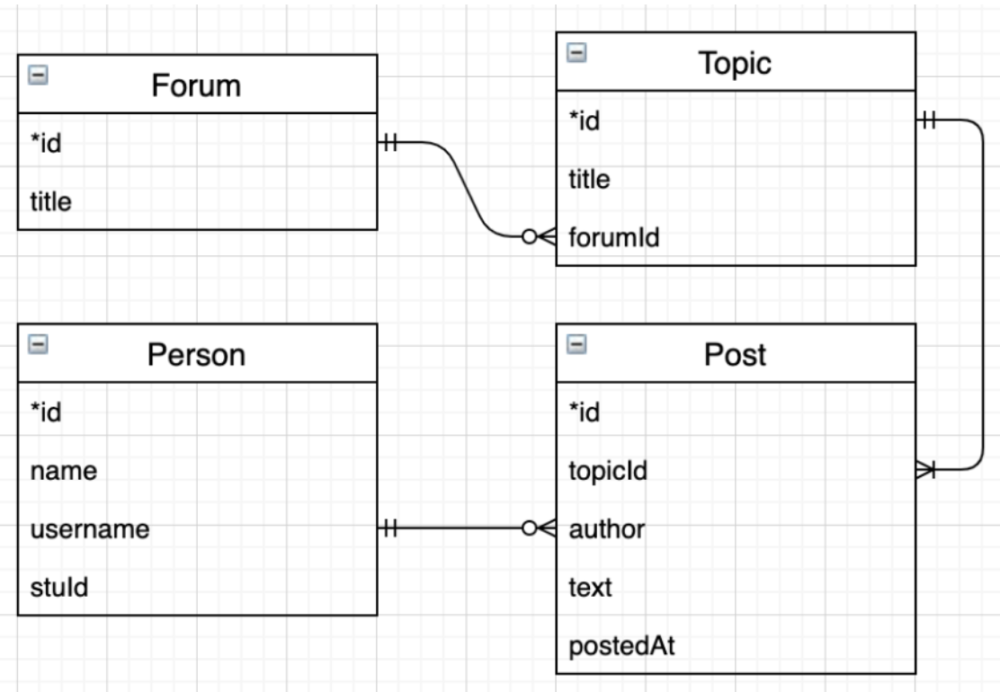

# ForumSite
# 1. 背景

在获得服务器、数据库和模板的使用建议以及几个url网页处理的例子情况下进行编程设计。

# 2. 项目简介

该项目设计包括了浏览器页面，服务器，数据库三部分：
服务器继承于nanoHttpd服务器，数据库使用mariaDB数据库，同时使用freemarker作为模板引擎创建动态网页。

## 数据库
数据库使用mariaDB数据库，数据库的table主要包括了person,forum,topic,post四个。关闭数据库的自动提交，采用手动提交的方式进行，便于数据出现问题时进行回滚操作。

* 简单ER图设计如下：

在最初的设计中我在forum和topic，topic和post，post和person之间都增加了join table，同时将topic设计为可以同时属于多个forum下。最初设计考虑在实际情况下的数据库检索速度，增加topic_post_relation和person_post_relation可以更快的检索出一个topic下有多少个post，或者一个person发表了多少个的Post。但后来发现计算数量的情况不多，且在实际使用中只计算出一个数量也是没有意义的，反而增加了join表的数量。另外，一个topic在使用中只可能属于一个forum，故最后综合考虑删除了三个join table。最终ER图如下：

## 网页设计
使用freemarker创建的模板文件存储在服务器端，当有用户访问这个页面时，freemarker会在页面返回前将其中一些内容进行动态替换成服务器从数据库获取的数据。

## 服务器
主函数中用单例模式创建了一个服务类的实例，将对数据库的操作和对模板的设定都作为该实例的属性包括在内。最后运行服务器，在指定的端口进行监听，一旦客户端发起请求，服务器根据请求的url对数据库进行相应的操作并返回动态页面。不考虑并发，一次只能一个用户访问。

## 运行
使用ant进行自动化运行。

编译：ant compile
运行：ant run

